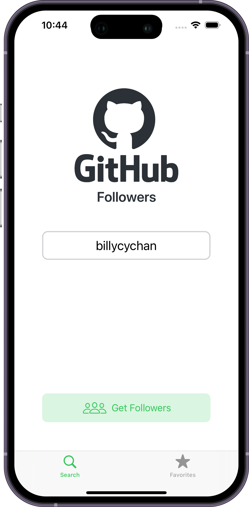
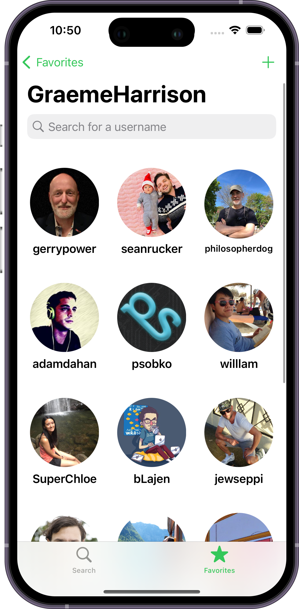
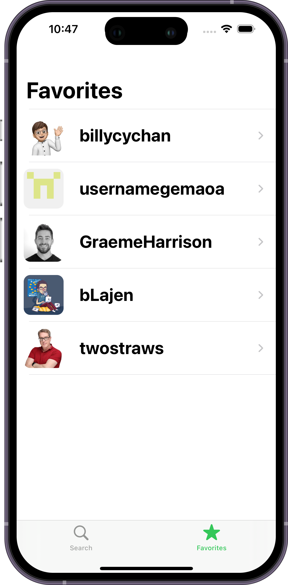
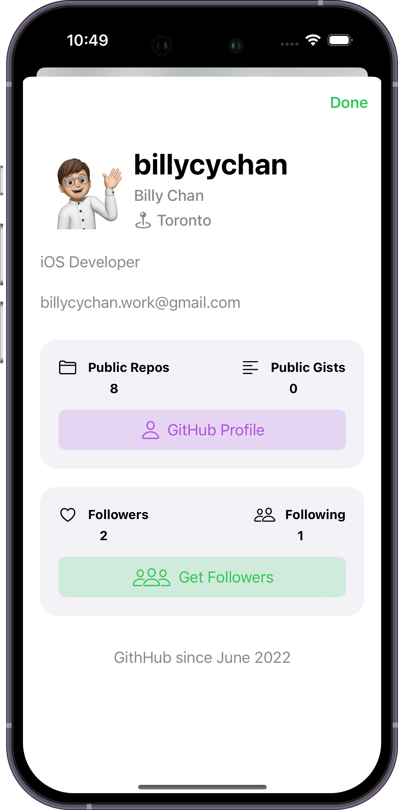

# GHFollower 

## Description
GHFollowers is an iOS app that allows a user to search for github users, and browse their followers.

    
    
    
    

 

## Additional Work
- Introduced the MVVM-C architecture, Combine for view-viewModel bindings
- Utilized the async events and functions with async/await concurrency and 
- Refactored the original layer to the generic one
- Implemented image caching for SwiftUI View 

## Technical Details 
- Programmatic UI, No storyboard used, UIKit based, with a SwiftUI View `FollowerView`
- MVVM-C architecture is used
  - Combine framework is used for binding between view and viewModel
  - Coordinators are for the navigation between scenes
- Error Handling
  - `GFError` enum is used for representing difference errors in the app
- Generic NetworkManager
  - `Endpoint` enum is used for configure the `host`, `path`, `methodType` and `queryItems` for each API endpoint (getFollower, getUserInfo)
- Image Caching with NSCache for remote image
- Using local persistence `UserDefault` to store the users to favorites
- Custom Views (`GFTitleLabel`, `GFTextField`, `GFButton`...)
- Using delegates and protocol

# Features 
- Searching for user
- Listing followers for an user
- Filtering followers with text
- Showing the user information of an user
- Opening an Github Profile URL in app
- Showing favorited users
- Adding users to favorites 
- Dark mode supported

# Requirements
- iOS 17.0+
- XCode 15.2+

# Acknowledgments
This is originally an example take-home project from Sean Allen's [Take Home Project Course](https://seanallen.teachable.com/p/take-home). Thanks.